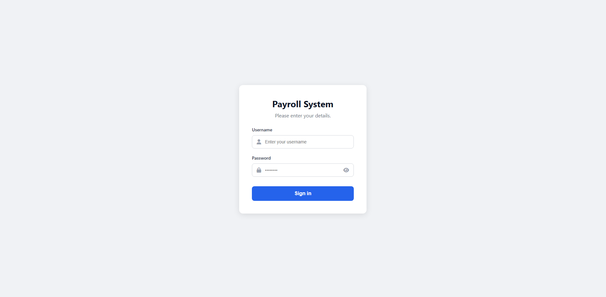
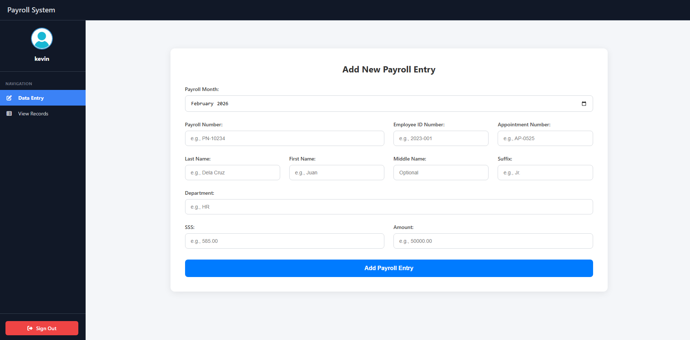

# Employee Payroll Management System

A web-based application designed to streamline employee record management and payroll processing. Built with Core PHP and MySQL, the system features secure authentication, role-based access, and data export capabilities.

## Key Features

### Security & Authentication
* **Secure Login:** User authentication system utilizing BCrypt password hashing.
* **Session Management:** Protected routes ensuring only authenticated users can access sensitive data.
* **SQL Injection Protection:** Implements PDO Prepared Statements for all database interactions.
* **XSS Protection:** Input sanitization to prevent cross-site scripting attacks.

### Payroll & Data Management
* **Dashboard Overview:** Centralized view of payroll entries with dynamic pagination.
* **Advanced Search:** Filtering capability by Name, Payroll Number, or Month.
* **CRUD Operations:** Full capability to Create, Read, and Update employee records.
* **Data Export:** Functionality to export search results or full database records to CSV format.
* **Activity Logging:** Automated tracking of user login and logout actions.

## Technical Stack
* **Backend:** PHP 8+ (PDO Driver)
* **Database:** MySQL / MariaDB
* **Frontend:** HTML5, CSS3, JavaScript
* **Server:** Apache (XAMPP/WAMP environment)

## Application Previews

| Login Interface | Dashboard View |
|:---:|:---:|
|  |  |

## Installation Guide

### Prerequisites
* XAMPP (or similar local server environment like WAMP/MAMP).
* Git (optional, for cloning).

### Step 1: Clone the Repository
Navigate to your local server's root directory (e.g., `htdocs`) and clone this repository:
```bash
git clone [https://github.com/yourusername/payroll-management-system.git](https://github.com/yourusername/payroll-management-system.git)
